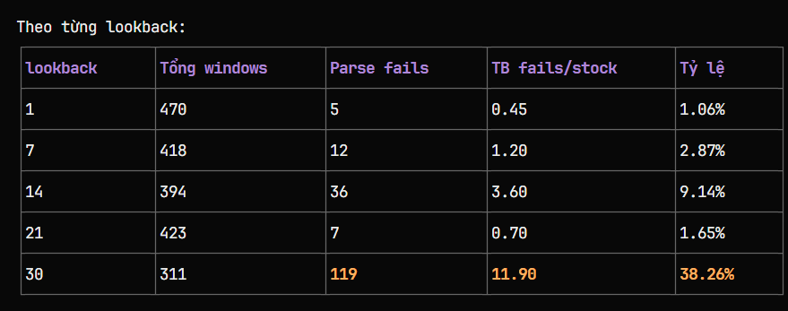

## Docs: update 1
Phân tích parse fail trong result_gemma4_e2b_1:
|Lookback | Tổng | Fail|
|---------|------|-----|
|lb7	  |43	 |  10 |
|lb14	  | 43	 |  17 |

### Nguyên nhân chính: Model trả về thiếu số (25-29 số thay vì 30). Ví dụ:
- 351.0602;351.0603;...;351.0626 → chỉ 25 số
- 358.53;358.53;...;358.53 → chỉ 25 số
Nguyên nhân phụ: Model không tuân thủ đúng số lượng yêu cầu, có thể do num_predict=1500 chưa đủ hoặc model bị chặn giới hạn token.
Để giảm fail rate: Cần tăng num_predict hoặc thêm logic retry với prompt nhắc model output đủ số.

### ==> main_gemma3.py fix thành công 0 parse fail

## Docs: update 10_05_26

Chạy cùng source với phi:2.7b và gemma4:e2b thì kết quả phi như sau:

Tỷ lệ khá ổn, nhưng với lookback 30 thì vẫn còn khá cao

Dưới đây là phân tích nguyên nhân parse fail cao ở model phi:2.7b:
1. Model quá nhỏ cho task này
Phi-2 (2.7B parameters) là model rất nhỏ, khó làm theo instruction phức tạp về format output.
2. Model bắt chước format input thay vì output instruction
Input là JSON dict/array → model có xu hướng tiếp tục xuất dict giống input thay vì output dạng số;số;số như yêu cầu. Bằng chứng là raw_output trong failures chứa đầy:
- {'2021-12-31': {'open': 178.53, ...}} 
- [{'Date': '...', 'Open': ..., ...}, ...]
- Dict date→price mapping
3. Retry mechanism không giải quyết đúng vấn đề
Retry chỉ đổi từ "4 decimals" → "2 decimals" mà không hề nói "KHÔNG output Python dict hay JSON". Cần một retry instruction mạnh hơn.
4. Lookback càng dài, fail càng nhiều
- lb=1: 1.06% fail
- lb=7: 2.87% fail
- lb=14: 9.14% fail
- lb=21: 1.65% fail
- lb=30: 38.26% fail ← cực cao
Với lb=30, input dài ~180+ tokens → attention của model 2.7B bị quá tải, mất instruction về format output.
5. Thiếu few-shot example cụ thể
Prompt chỉ có TEMPLATE/EXAMPLE trừu tượng. Không có ví dụ "input JSON → output đúng" thực tế.
6. num_predict=1500 có thể bị truncate
Output dài (nhất là khi model xuất dict 60+ entries) bị cắt ngang → không parse được.
Tóm lại: Model quá nhỏ + input dài + instruction không đủ mạnh + retry sai hướng = fail rate cao, đặc biệt ở lookback 30.

Còn gemma4:e2b thì ngay từ lookback 1 đã gặp parse fail khá cao rồi.